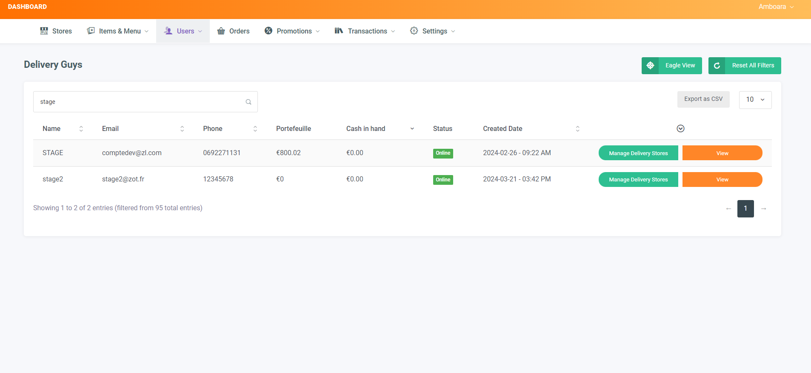

# Documentations

## Filtration des commandes du livreurs:

<video width="640" height="360" controls>
  <source src="./assets/vids/Enregistrement de l&apos;écran 2024-09-27 033053.mp4" type="video/mp4">
  Your browser does not support the video tag.
</video>

## Colonne Cash in hand:

## Validation automatique des commandes et code couleur selon l'utilisateur ayant validé la commande:

### Definir les delais de validation
<video width="640" height="360" controls>
  <source src="./assets/vids/GestiondesDelans.mp4" type="video/mp4">
  Your browser does not support the video tag.
</video>

### Activer/desactiver la validation auto
<video width="640" height="360" controls>
  <source src="./assets/vids/ValidationAuto.mp4" type="video/mp4">
  Your browser does not support the video tag.
</video>
